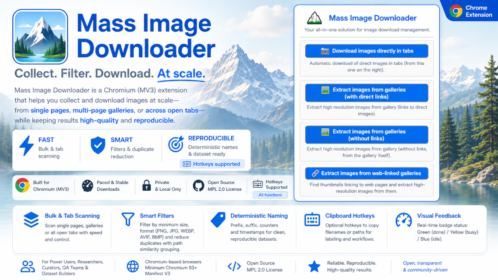

# Mass Image Downloader

  

Mass Image Downloader is a Chromium Manifest V3 extension for collecting and downloading images at scale from open tabs, single pages, and multi-page galleries while keeping results filtered, named, and reproducible.

## Features

- Bulk image download across open tabs.
- Gallery extraction for direct links, visual galleries, and web-linked gallery pages.
- Format and dimension filters for JPG/JPEG, PNG, WEBP, AVIF, and BMP.
- Deterministic filename modes using prefix, suffix, both, or timestamp.
- One-click manual save overlay for selective curation.
- Image Inspector mode with preview, metadata, navigation, and save controls.
- Clipboard hotkeys for dataset labeling.
- Toast notifications, badge states, debug levels, pacing, batching, and concurrency controls.

## Installation

1. Clone or download this repository.
2. Open a Chromium-based browser and go to the extensions page:
   - Chrome: `chrome://extensions`
   - Edge: `edge://extensions`
   - Brave: `brave://extensions`
3. Enable Developer Mode.
4. Select **Load unpacked**.
5. Choose the repository root folder.

## Quick Start

1. Pin the extension icon.
2. Open the popup and choose a download mode.
3. Configure formats, size filters, naming, pacing, and gallery limits from the Options page.
4. Run the workflow from the popup or with the configured keyboard shortcuts.

## Documentation

- [Documentation Hub](docs/README.md) - entry point for all manuals.
- [User Manual](docs/user-manual/README.md) - basic usage and workflows.
- [Configuration Guides](docs/configuration-guides/configuration-guides.md) - scenario-based setup.
- [Technical Manual](docs/technical-manual/README.md) - internal behavior and execution flow.
- [Advanced Manual](docs/advanced-manual/README.md) - design rationale, trade-offs, and edge cases.
- [Extended Project Overview](docs/project-overview-extended.md) - the previous long-form README preserved as a reference.
- [Hotkeys Policy](docs/hotkeys/hotkeys.md) - official shortcut policy.

## Requirements

- Chromium-based browser.
- Minimum Chromium version: `93`.
- Manifest version: `3`.
- Tested primarily on Brave.

## Version

The current public version is shown by the GitHub Release badge above.

For source-level validation, check:

- the latest GitHub tag/release
- the root `VERSION` file
- `manifest.json`

See [CHANGELOG.md](CHANGELOG.md) for release history.

## Contributing

Contributions should follow the project flow: feature or chore branch, PR to `dev`, merge to `main`, then tag/release.

See [CONTRIBUTING.md](CONTRIBUTING.md), [CODE_OF_CONDUCT.md](CODE_OF_CONDUCT.md), and [SECURITY.md](SECURITY.md).

## Support the Project

If Mass Image Downloader helps your workflow, consider starring the repository, opening focused issues, sharing reproducible test cases, or contributing documentation and fixes through the standard branch flow.

Responsible feedback is especially useful for gallery edge cases, browser compatibility checks, and real-world configuration scenarios.

## Acknowledgements

Thank you for using Mass Image Downloader and supporting a focused, privacy-friendly tool for collecting images with predictable, browser-native workflows.

Built for power users, researchers, curators, QA teams, dataset builders, and automation workflows that need controlled output without external services, tracking, or unnecessary complexity.

Made with ❤️ by Del-Pacifico.

## License

Mass Image Downloader is licensed under the [Mozilla Public License 2.0](LICENSE).

---

<!-- Badges (Footer) -->

